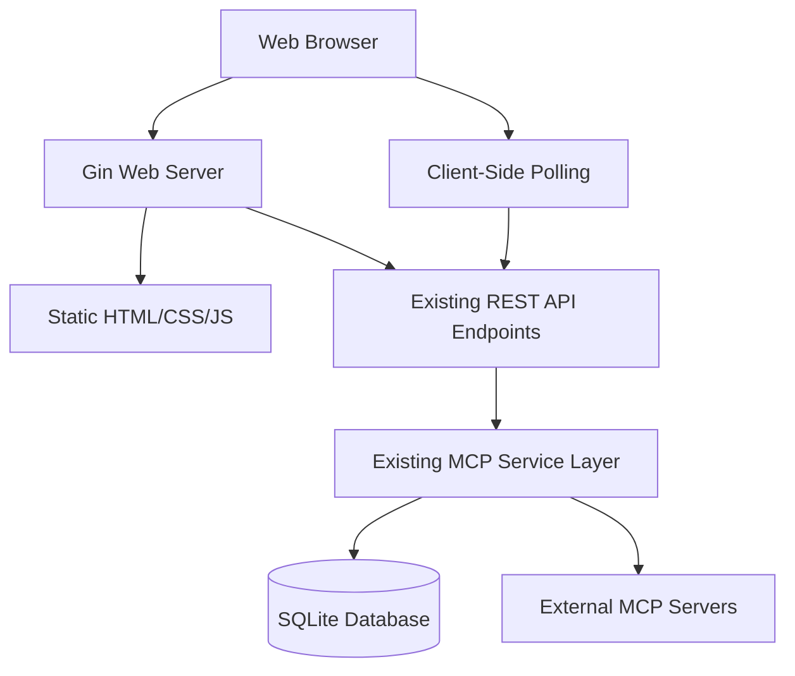

# Design Document

## Overview

The web UI feature will add a modern, responsive web interface to the MCP Jungle application using a CDN-based frontend framework approach. The design uses client-side polling for updates and integrates seamlessly with the existing Gin-based HTTP server and API endpoints without requiring any changes to the backend logic.

The web interface will be served as static files from the existing Go server, eliminating the need for separate frontend build processes or Node.js dependencies. The frontend will use Alpine.js (via CDN) for reactive components and Tailwind CSS (via CDN) for styling, providing a lightweight yet powerful development experience.

## Architecture

### High-Level Architecture



### Frontend Architecture

The frontend will use a component-based architecture with Alpine.js:

- **Static HTML Pages**: Served directly by the Go server
- **Alpine.js Components**: Reactive UI components for different sections
- **Tailwind CSS**: Utility-first CSS framework for styling
- **Vanilla JavaScript**: For polling and API communication
- **CDN Dependencies**: All external libraries loaded from CDN

### Backend Integration

The web UI will integrate with minimal changes to the existing server architecture:

- **Static File Routes Only**: Add only static file serving routes to existing Gin router
- **Middleware Reuse**: Leverage existing authentication and initialization middleware unchanged
- **API Endpoint Reuse**: Use existing REST API endpoints without modification
- **Polling-Based Updates**: Use client-side polling instead of SSE to avoid backend changes

## Components and Interfaces

### Frontend Components

#### 1. Dashboard Component (`dashboard.html`)
- System overview and statistics
- Server status summary
- Recent activity feed
- Quick action buttons

#### 2. Servers Management Component (`servers.html`)
- Server list with status indicators
- Server registration form
- Server actions (start/stop/delete)
- Server configuration details

#### 3. Tools Browser Component (`tools.html`)
- Tool listing with search and filtering
- Tool detail view with schema display
- Tool invocation form with parameter inputs
- Execution results display

#### 4. Configuration Component (`config.html`)
- System configuration display
- Server mode and initialization status
- Client management (production mode only)

#### 5. Shared Components
- Navigation header
- Error notification system
- Loading indicators
- Modal dialogs

### Backend Components

#### 1. Static File Server
```go
// Serves static HTML, CSS, JS files
func setupStaticRoutes(r *gin.Engine) {
    r.Static("/static", "./web/static")
    r.StaticFile("/", "./web/index.html")
    r.StaticFile("/dashboard", "./web/dashboard.html")
    r.StaticFile("/servers", "./web/servers.html")
    r.StaticFile("/tools", "./web/tools.html")
    r.StaticFile("/config", "./web/config.html")
}
```

#### 2. No Additional Backend Components Required
The existing backend components will be used as-is:
- Existing API endpoints for data operations
- Existing middleware for authentication
- Existing service layer for business logic

## Data Models

### Frontend Data Models

#### Server Status Model
```javascript
const serverModel = {
    name: '',
    description: '',
    url: '',
    status: 'unknown', // 'running', 'stopped', 'error', 'unknown'
    lastSeen: null,
    toolCount: 0,
    error: null
}
```

#### Tool Model
```javascript
const toolModel = {
    name: '',
    description: '',
    server: '',
    inputSchema: {},
    lastUsed: null
}
```

#### System Status Model
```javascript
const systemModel = {
    initialized: false,
    mode: 'dev', // 'dev' or 'prod'
    serverCount: 0,
    toolCount: 0,
    uptime: 0
}
```

### Polling Data Models

The frontend will poll existing API endpoints and cache responses locally:

#### API Response Caching
```javascript
const apiCache = {
    servers: { data: [], lastFetch: null },
    tools: { data: [], lastFetch: null },
    config: { data: {}, lastFetch: null }
}
```

## Error Handling

### Frontend Error Handling

1. **API Request Errors**
   - Display user-friendly error messages
   - Retry mechanisms for transient failures
   - Fallback to cached data when appropriate

2. **Polling Errors**
   - Automatic retry with exponential backoff
   - Connection status indicator
   - Graceful handling of network failures

3. **Validation Errors**
   - Real-time form validation
   - Clear error messaging
   - Prevention of invalid submissions

### Backend Error Handling

1. **Static File Serving**
   - 404 handling for missing assets
   - Fallback to default pages
   - MIME type detection

## Testing Strategy

### Frontend Testing

1. **Manual Testing**
   - Cross-browser compatibility testing
   - Responsive design testing
   - Accessibility testing with screen readers

2. **Integration Testing**
   - API endpoint integration
   - Polling mechanism functionality
   - Real-time update functionality

### Backend Testing

1. **Unit Tests**
   - Static file serving
   - Route configuration
   - Middleware integration

2. **Integration Tests**
   - Web UI and API integration
   - Authentication flow testing
   - Static asset delivery

### Performance Testing

1. **Load Testing**
   - Multiple concurrent web clients
   - Static file serving under load
   - API endpoint performance with polling

2. **Browser Performance**
   - JavaScript execution performance
   - Memory usage in long-running sessions
   - Network request optimization

## Security Considerations

### Authentication Integration
- Reuse existing authentication middleware
- Session management for web clients
- CSRF protection for form submissions

### Content Security Policy
```html
<meta http-equiv="Content-Security-Policy"
      content="default-src 'self';
               script-src 'self' 'unsafe-inline' https://unpkg.com https://cdn.tailwindcss.com;
               style-src 'self' 'unsafe-inline' https://cdn.tailwindcss.com;
               connect-src 'self';">
```

### Input Validation
- Client-side validation for user experience
- Server-side validation for security
- XSS prevention in dynamic content

## Deployment Considerations

### File Structure
```
web/
├── index.html          # Main landing page
├── dashboard.html      # Dashboard page
├── servers.html        # Server management page
├── tools.html          # Tool browser page
├── config.html         # Configuration page
├── static/
│   ├── css/
│   │   └── app.css     # Custom styles
│   ├── js/
│   │   ├── app.js      # Main application logic
│   │   ├── sse.js      # SSE handling
│   │   └── components/ # Alpine.js components
│   └── assets/
│       └── logo.png    # Static assets
```

### CDN Dependencies
- Alpine.js: `https://unpkg.com/alpinejs@3.x.x/dist/cdn.min.js`
- Tailwind CSS: `https://cdn.tailwindcss.com`
- Heroicons: `https://heroicons.com/` (for icons)

### Build-Free Deployment
- No compilation or build steps required
- Direct file serving from Go binary
- Embedded static files using Go embed for production build
- Docker container includes all web assets